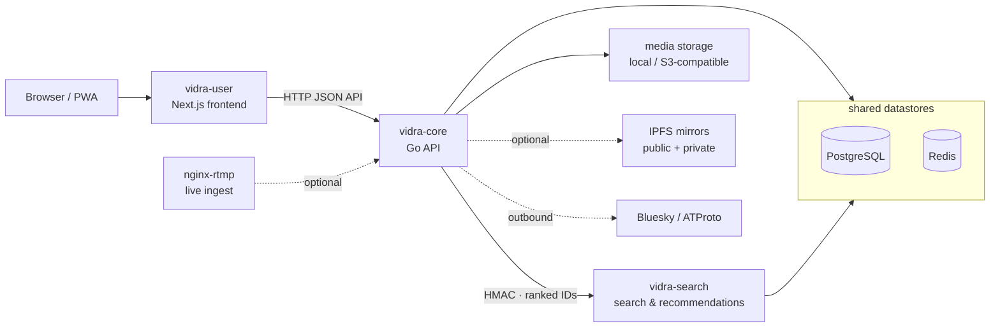

<p align="center">
  
</p>

<h3 align="center">Run your own video platform.</h3>

<p align="center">
  <a href="#quick-start">Quick start</a> ·
  <a href="#features">Features</a> ·
  <a href="#architecture">Architecture</a> ·
  <a href="#environments">Deployment</a> ·
  <a href="https://github.com/yegamble/vidra-branding/blob/main/design-system/README.md">Design system</a> ·
  <a href="https://github.com/yegamble/vidra-branding">Brand</a>
</p>

<p align="center">
  <a href="https://github.com/yegamble/vidra-core/releases"></a>
  <a href="https://github.com/yegamble/vidra/actions/workflows/meta-ci.yml"></a>
  <a href="LICENSE"></a>
  
  
  
  
</p>

Vidra is a federated video platform you install yourself, the way you would install
WordPress. One low-cost server serves your viewers because distribution is designed
to be offloaded — HLS from your own box, a CDN in front of it, or IPFS gateways
carrying public media. It federates identity over ATProto (Bluesky), stores media
on anything S3-compatible if you want it to, and it is free software under AGPL v3.

- **Yours to run.** AGPL v3, one compose file, no vendor between you and your
  viewers. A one-way importer brings a whole PeerTube instance with it.
- **A real creator pipeline.** Resumable uploads, an H.264/AAC HLS ladder, live
  streaming over RTMP with replay-to-VOD, Whisper auto-captions, chapters,
  storyboards.
- **Not a science project.** 214-path OpenAPI contract, drift-guarded codegen,
  race-detected CI in every repo, axe accessibility as a hard gate, health/readiness
  probes (`/healthz`, `/readyz`, `/schemaz`, `/version`), metrics, tracing,
  backup/restore/rollback scripts.

Vidra is a clean-room, PeerTube-inspired implementation — not a fork, and not a
hosted service.

## Features

**Publish.** Direct, chunked/resumable, and async URL uploads (SSRF-guarded,
optional sandboxed yt-dlp extractor) with per-user storage quotas and optional
ClamAV scanning. Transcoding to an H.264/AAC HLS ladder with I-frame trick-play
playlists and an optional VP9/WebM download alternate, plus thumbnails,
storyboards, and chapters. Live streaming over RTMP with privacy-gated HLS and
replay-to-VOD. Channel auto-sync can mirror an external channel's uploads.

**Watch.** A bespoke player with keyboard shortcuts, picture-in-picture and
theatre mode; WebVTT captions with optional Whisper auto-generation; clickable
timestamps; playlists, subscriptions, history, and a trending home feed.
Password-protected videos mint scoped playback tokens; embeds, RSS, oEmbed, and
a sitemap are built in, and the app installs as a PWA.

**Find.** A dedicated [search service](https://github.com/yegamble/vidra-search):
hybrid full-text + trigram search, typo-tolerant autosuggest, decayed-counter
trending, co-visitation recommendations, and a learned LightGBM ranker that is
shadow-evaluated online before manual activation. If it is ever down, core falls
back to its own SQL — search never takes the site with it.

**Connect.** Sign in with Bluesky or any ATProto PDS; optional outbound
cross-posting of public videos to Bluesky. OAuth/OIDC login and TOTP two-factor.
1:1 direct messages with attachments and opt-in end-to-end encryption (client-side
Olm — the server only stores opaque envelopes) with disappearing messages.

**Moderate.** Reports that actually notify staff, per-user sensitive-content
policy with creator content warnings, registration approval, admin console with
runtime-mutable instance settings, and audit-enveloped job observability.

**Operate.** One compose file; health/readiness probes (`/healthz`, `/readyz`, `/schemaz` migration probe, `/admin/system` 6-component status); Prometheus metrics and
OpenTelemetry tracing; local or S3-compatible storage with optional dual-tier
IPFS mirroring (public gateway offload plus a private swarm-keyed tier);
scripted deploy, rollback, backup, and restore plus the `vidra` operator CLI (`doctor` 18 checks, `status`, `logs`). WCAG 2.2 AA is enforced by axe
as a hard CI gate, on the tokens of a documented
[design system](https://github.com/yegamble/vidra-branding/blob/main/design-system/README.md).

Feature-by-feature detail lives in
[`vidra-core/docs/features.md`](https://github.com/yegamble/vidra-core/blob/main/docs/features.md)
and the [PeerTube parity ledger](.ralph/specs/peertube-feature-ledger.md).

## Architecture

Vidra is split across **three independent repositories**, tied together by this
lightweight **meta-repo**:



| Repo | What | Stack |
|------|------|-------|
| [`vidra-core`](https://github.com/yegamble/vidra-core) | Backend / HTTP API | Go, Echo, PostgreSQL, sqlc, Redis, Docker |
| [`vidra-user`](https://github.com/yegamble/vidra-user) | Frontend | Next.js, TypeScript, Tailwind |
| [`vidra-search`](https://github.com/yegamble/vidra-search) | Search, autosuggest & recommendations service | Go, PostgreSQL, Redis |

Each repo is self-contained — its own `go.mod` / `package.json`, Docker setup, and
GitHub Actions CI. The frontend consumes the backend's HTTP API at runtime via
`NEXT_PUBLIC_API_BASE_URL`, with no build-time coupling. `vidra-search` is an
**internal-only** service — HMAC-authenticated, called only by `vidra-core`, never
exposed to the browser.

## Prerequisites

- **Docker** with Compose **v2.20+** (the root compose uses `include:` and profiles).
  Deploying with `docker-compose.prod.yml` additionally needs **v2.24+** — it uses
  the `!reset`/`!override` merge tags, without which the production overlay
  silently fails to close the published database ports
  (see [`deploy/README.md`](deploy/README.md#host-prerequisites)).
- **GNU make** and **git**.
- **Node.js 20+** and **npm**, for host-side frontend dev.

`bootstrap.sh` clones the three sibling checkouts (`vidra-core`, `vidra-user`,
`vidra-search`) automatically; they are git-ignored by this repo.

## Quick start

```bash
git clone https://github.com/yegamble/vidra.git
cd vidra
make dev                  # bootstrap + backend stack (postgres, redis, migrate, api :8080, search :8081)

# Frontend (in another shell) — Next.js dev with HMR against the live backend:
cd vidra-user && npm ci && NEXT_PUBLIC_API_BASE_URL=http://localhost:8080 npm run dev

make seed                 # optional: demo account (demo@vidra.local / demo-password-123) + @demo channel
```

Run the whole stack in containers (frontend on :3000) with `make up`. The local
stack disables the global API rate limiter by default — re-enable it with
`RATE_LIMIT_ENABLED=true make dev`.

## Everyday commands

| Command | What it does |
|---------|--------------|
| `make dev` | Backend + search stack (postgres, redis, migrate, api :8080, search :8081); run the frontend on the host for HMR. |
| `make up` | Full stack in containers, including the frontend on :3000. |
| `make dev-hot` | Full stack in Docker with live reload (see below); tail with `make dev-hot-logs`. |
| `make dev-hot-down` | Stop the hot-reload stack; data volumes preserved. |
| `make dev-hot-nuke` | **Destructive.** Stop hot-reload stack and delete all volumes (db data + caches). |
| `make seed` | Seed a demo account (`demo@vidra.local` / `demo-password-123`) + `@demo` channel. |
| `make test` | Run **all three** repos' canonical CI gates: `vidra-core` `make ci`, `vidra-search` `make ci`, `vidra-user` `npm run ci`. |
| `make e2e-backed` | Run the backend-backed Playwright suite against **`vidra-core`'s own compose stack** (no search service). |
| `make logs` | Tail all service logs. |
| `make down` | Stop the stack; data volumes preserved. |
| `make nuke` | **Destructive.** Stop the stack and delete data volumes (fresh start). Prompts, or needs `CONFIRM=1`. |
| `make ipfs-live` | Core stack + live public IPFS mirror + separate private mirror (see below). |
| `make env-check` | Show which env template the compose commands would use. |
| `make help` | List all targets. |

Production/staging operations (all honour `PROD_ENV_FILE=env/staging.env`):

| Command | What it does |
|---------|--------------|
| `make release VERSION=v0.2.0` | `deploy/release.sh`: guarded `gh release create` in all three repos → watch each `publish-container` run → verify the GHCR image. Prompts, or needs `CONFIRM=1`. |
| `make prod-config` | Render + validate the production compose chain; catches missing required secrets. |
| `make deploy` | `deploy/deploy.sh`: pre-deploy dump → pull → gated migrations → `up -d --no-build` → probe. |
| `make rollback TAG=v0.2.0` | Rewrite the three `VIDRA_*_TAG` values, pull, restart, re-probe. App only — no schema change. |
| `make backup` | `deploy/backup.sh`: `pg_dump -Fc` → gzip → optional off-site → 14 daily + 8 weekly retention. |
| `make restore DUMP=… CONFIRM=1` | **Destructive.** `deploy/restore.sh`: drop, recreate, `pg_restore -j4`, migrate, probe. Prompts, or needs `CONFIRM=1`. |
| `make prod-logs` / `make prod-down` | Tail / stop the production stack. |

## Hot reload (`make dev-hot`)

`make dev-hot` runs the **whole stack in Docker with live reload** — no image
rebuilds while developing:

- **api**: `air` on the bind-mounted `vidra-core/` tree recompiles and restarts
  in ~1–3s, on the same port `:8080`.
- **search**: same `air` pattern on `:8081`; it shares the core Postgres (schema
  `search`) and Redis (DB 1), migrated by a one-shot `search-migrate` service.
- **frontend**: `next dev` (webpack + polling) on bind-mounted `vidra-user/` HMRs
  instantly; `node_modules` and `.next` live in named volumes.

**First run is slow** (once): volume seed, `go mod download`, cold compile — a few
minutes; later starts are fast. `NEXT_PUBLIC_API_BASE_URL` is a **runtime** env
here and must be a browser-reachable host URL, **not** `http://api:8080`; if you
override `HTTP_PORT`, match it:
`HTTP_PORT=8088 NEXT_PUBLIC_API_BASE_URL=http://localhost:8088 make dev-hot`. The
dev overlay only applies when `-f docker-compose.dev.yml` is passed; `make up`,
`make dev`, and both Dockerfiles are untouched.

## IPFS live mode

`make ipfs-live` enables the public mirror on a live Kubo node — the client gateway
defaults to `https://ipfs.io` (override with
`IPFS_PUBLIC_GATEWAY_URL=https://your-gateway.example make ipfs-live`) — and starts
the swarm-keyed private mirror alongside it. Kubo's RPC ports are loopback-only;
only the libp2p swarm port is public. This is an intentional disclosure boundary:
**a public CID may remain retrievable after the local node unpins it.**

## Environments

The canonical environment matrix lives in
[`.ralph/specs/environments.md`](.ralph/specs/environments.md), with ready-to-copy
per-environment templates under [`env/`](env/) and a reference single-host TLS
deployment (compose overlay + Caddy + deploy/backup/rollback scripts) under
[`deploy/`](deploy/).

A **real deployment never builds on the box** — it pulls tagged images from GHCR
and applies [`docker-compose.prod.yml`](docker-compose.prod.yml), which is what
binds the api/frontend to `127.0.0.1`, removes the Postgres/Redis/search and
optional-profile (minio, clamav, whisper, otel) port publishes entirely, and
adds restart policies, log caps and TLS:

```bash
cp env/production.env.example env/production.env   # fill in secrets; it is git-ignored
git check-ignore -v env/production.env             # must match, or stop

# Never hand-type the -f / --profile chain — it omits the external-postgres/
# external-redis overlays and EXTRA_COMPOSE_PROFILES (e.g. ipfs, storage).
# Use the wrapper which builds the chain from the env file:
ENV_FILE=env/production.env ./deploy/compose.sh config -q  # validate
ENV_FILE=env/production.env ./deploy/compose.sh pull
ENV_FILE=env/production.env ./deploy/compose.sh up -d --no-build
# Or simply: make prod-config / make deploy
```

In practice use `./deploy/deploy.sh` (= `make deploy`), which wraps that with a
pre-deploy dump, exit-code-gated migrations and health probes. Note the explicit
`-f` chain **disables** auto-loading of `docker-compose.override.yml` — intended,
but it means production must set `SEARCH_SERVICE_URL` and `SEARCH_INTERNAL_SECRET`
in the env file itself.

**One command per thing an operator does.** `vidra` is a host-side binary — build
it with `make build-vidra` in `vidra-core` (a one-line curl installer is planned):

```bash
vidra setup                  # interview → env/production.env + deploy/Caddyfile.local
vidra setup --answers a.txt  # or --non-interactive with the answers as flags
vidra doctor                 # 18 checks: compose, port exposure, config, backups, reachability
vidra status                 # what is running, and whether it answers
vidra logs [service] | vidra restart <service>
vidra deploy | rollback <tag> | backup | restore <dump> | release <tag>
```

Those last five **exec `deploy/*.sh`** and return its exit code unchanged — same
gates, same refusals, one copy of each.

Three rules worth internalizing: **staging is production config with throwaway
data** (promote the exact image tags); the containerized frontend resolves its
origin at **runtime** (`PUBLIC_API_BASE_URL` via `/runtime-config.js`), so one
image serves any domain; and **claim the owner account first** — on a fresh
install every signup path refuses until the one-time owner-claim token from the
api's boot log is redeemed at `/setup/claim`. Production is fail-secure
(`VIDRA_ENV=production` refuses dev secrets and dev mail capture); see
[`deploy/README.md`](deploy/README.md) for first-boot ordering, host
prerequisites, the firewall caveat, backups/restore, secret rotation, and the
dirty-migration runbook.

## The API contract

`vidra-core/api/openapi.yaml` is the source of truth for the HTTP API. `vidra-user`
regenerates `lib/api/generated.ts` from it with `npm run codegen`, and
`lib/api/types.ts` is derived from that — **never hand-edit shapes**. `contract-ci`
guards drift twice: `scripts/check-contract.mjs` asserts every `/api/` path the
frontend calls exists in the spec, and a codegen step fails if `generated.ts` is
stale. In CI the spec is fetched from the public `vidra-core` repo; locally the
sibling `../vidra-core` checkout is used.

A breaking API change spans two repos with no atomic commit — stage it back-compat:

1. Land the additive, back-compat change in `vidra-core` (its `openapi` CI publishes the updated spec).
2. Update `vidra-user` to the new shape.
3. Remove the old endpoint in a later `vidra-core` change.

`vidra-search` exposes a **separate, internal** contract at
`vidra-search/api/openapi.yaml` (all under `/internal/v1`, HMAC-authenticated),
consumed only by `vidra-core`, staged the same back-compat way.

## CI

Each repo runs its own GitHub Actions:
- **vidra-core** — `backend-ci` (`make ci`), `backend-integration`, `openapi`, `schema-compat` (previous-release compat), `ci-guard`; plus `bench-fuzz`, `ipfs-integration`, `publish-container` on release.
- **vidra-user** — `frontend-ci` (`npm run ci`), `contract-ci`, `frontend-e2e-backed`, `ci-guard`; plus `publish-container`.
- **vidra-search** — `search-ci` (`make ci`), `search-integration`, `openapi`, `training-ci`, `ci-guard`; plus `publish-container`.

Each repo also carries additional workflows — see each repo's `.github/workflows/`. This
meta-repo runs `meta-ci` (validates `bootstrap.sh` and the full-stack compose config).

## Repo layout & docs

`bootstrap.sh` is idempotent: it clones each component if missing, otherwise
`git pull --ff-only`. The `./vidra-core`, `./vidra-user`, and `./vidra-search`
directories are independent git checkouts, git-ignored by this repo.

| Doc | What |
|-----|------|
| [`docs/productionization/README.md`](docs/productionization/README.md) | Productionization program: phases 1–5, interfaces, risks, architecture-today (source of truth for waves 4–5). |
| [`.ralph/specs/architecture.md`](.ralph/specs/architecture.md) | Living architecture doc: subsystems and the shared Postgres/Redis topology across the three services. |
| [`.ralph/specs/security.md`](.ralph/specs/security.md) | Security posture and planned controls (CORS allow-list, config hygiene, token hashing, fail-secure prod). |
| [`.ralph/specs/testing.md`](.ralph/specs/testing.md) | Test strategy: unit / integration / migration / fuzz / benchmark layers and how to run them. |
| [`.ralph/specs/search.md`](.ralph/specs/search.md) | Cross-repo map of the `vidra-search` service and how it plugs into core and user. |
| [`.ralph/specs/peertube-feature-ledger.md`](.ralph/specs/peertube-feature-ledger.md) | PeerTube feature-parity ledger with per-feature status and evidence. |
| [`.ralph/specs/environments.md`](.ralph/specs/environments.md) | Canonical environment matrix (local / dev / QA / staging / production) and the DX contract. |
| [`deploy/README.md`](deploy/README.md) | Reference single-host deployment: first-boot ordering, host prerequisites + firewall, droplet sizing, the prod compose overlay + Caddy TLS, deploy/rollback/backup/restore scripts, dirty-migration runbook, secret-rotation table, email. |
| [`docs/production-readiness-2026-07.md`](docs/production-readiness-2026-07.md) | Launch-gate audit: what must be done before a public deploy, and what is already handled. |

## Autonomous development (Ralph)

Run a **per-repo loop** inside each component checkout (`vidra-search` has no Ralph
control plane):

```bash
cd vidra-core && ralph --live
cd vidra-user && ralph --live
```

Each loop commits and pushes its own repo's `main` — no cross-repo pointer to bump.
For an API change that spans both, run the loops sequentially, backend first (see
[The API contract](#the-api-contract)). The root `.ralphrc`, `.ralph/PROMPT.md`,
and `.ralph/fix_plan.md` are **legacy** and drive nothing; `.ralph/specs/` is
preserved here as product docs.

## Why a meta-repo, not submodules?

The components talk only over HTTP at runtime, and each repo's loop commits and
pushes independently. A submodule pins a commit SHA and forces a
commit-child → bump-pointer → push-parent transaction on every sync. The meta-repo
gives the same "one place to clone and run" without any of that.

## Brand & design

The visual identity lives in
[`vidra-branding`](https://github.com/yegamble/vidra-branding): brand guidelines,
the identity system, governance, README assets, and the design-system reference.
The living component library is authored as the Claude Design project
**"Vidra Design System"**.

<p align="center">
  <a href="https://github.com/yegamble/vidra">
    
  </a>
</p>

## License

Vidra is free software licensed under the [GNU Affero General Public License v3.0](LICENSE).
